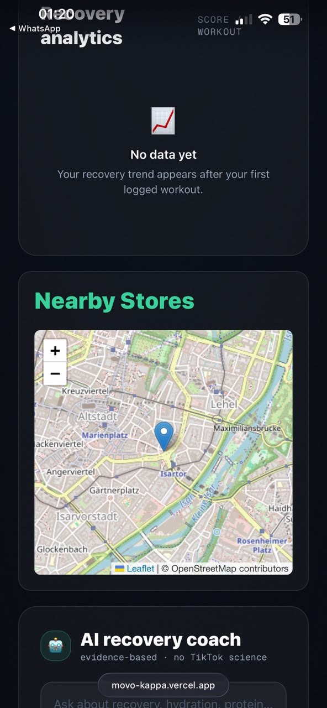
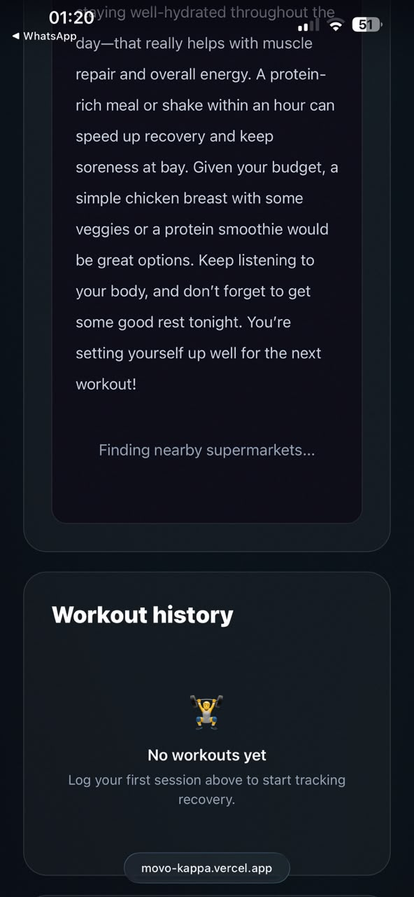

# MOVO: A Web-Based AI Tool for Post-Workout Recovery Nutrition for Students and Amateur Athletes

**FWP-4: Digital Health Programming (DHP)**

**Module:** MDH-14 Digital Health Programming (SS26)

**Student:** Bhargavi Mangalagiri

**Matriculation Number:** 22500326

**Date:** 16.07.2026

---

# 1. Introduction and Prototype Presentation

Regular physical activity is important for maintaining good health and improving sports performance. However, many student athletes focus more on training than on post-workout recovery. A lack of proper recovery nutrition can slow muscle recovery, increase fatigue, and reduce overall performance. To address this problem, our team developed **MOVO**, a web-based digital health application that provides personalised recovery guidance after exercise.

The application allows users to log their workouts and receive tailored recommendations based on the type, duration, and intensity of their workout. MOVO also includes an **AI Recovery Coach** that answers nutrition-related questions, recommends suitable recovery products, and displays nearby supermarkets where users can purchase the recommended items. These features are designed to provide students with practical and affordable recovery support.

The prototype was developed using **Next.js, Firebase Authentication, Cloud Firestore, the OpenAI API, OpenStreetMap (Overpass API),** and **Vercel**. These technologies provide a responsive web application with secure user authentication, cloud-based data storage, AI-assisted recommendations, and location-based services.

# 2. My Contributions to the Prototype

My primary role in the MOVO project was **Quality Assurance (QA)** and prototype validation. I ensured that the implemented features worked as expected and met the required quality standards before the final submission. My responsibilities included evaluating software quality, performing functional testing, documenting observations, and recommending improvements to enhance the overall user experience.

During the project, I designed and executed functional test cases for the application's core features, including user registration, login, logout, workout logging, the AI Recovery Coach, product recommendations, and the nearby supermarket map. These tests helped me verify the application's behaviour under different user scenarios and identify functional issues that required improvement.

In addition to functional testing, I evaluated the prototype using the **ISO/IEC 25010** software quality model by assessing functional suitability, usability, reliability, and performance efficiency. I also reviewed the user interface using **WCAG** accessibility principles to ensure the application was user-friendly and accessible. Finally, I documented the test results, prepared quality checklists, and recorded identified issues to support the delivery of a reliable and user-friendly prototype.

# 3. System Architecture Overview

The MOVO prototype is based on a cloud-based web application architecture that combines modern web technologies with digital health services. The application is developed using **Next.js** for the frontend, while **Firebase Authentication** manages user accounts and **Cloud Firestore** securely stores user data. The **OpenAI API** provides AI-based recovery guidance, and **OpenStreetMap (Overpass API)** is used to display nearby supermarkets based on the user's location. The entire application is deployed on **Vercel**, making the prototype accessible through a web browser.

As part of my quality assurance activities, I tested user authentication, workout logging, recovery recommendations, AI responses, and the supermarket map to verify that these components functioned correctly. This helped me confirm that the major system components communicated effectively and supported the core functionality of the application.

# 4. Main Features

The MOVO prototype includes several features that support post-workout recovery and improve the overall user experience.

- **User Authentication:** Users can create an account, log in securely, and manage their profiles using Firebase Authentication.

- **Workout Logging:** Users can record workout details such as type, duration, and intensity.

- **Recovery Recommendations:** The application provides personalised nutrition and hydration advice based on the recorded workout.

- **AI Recovery Coach:** Users can ask recovery and nutrition-related questions and receive AI-generated guidance.

- **Recommended Products:** The application suggests suitable food products to support post-workout recovery.

- **Nearby Supermarket Map:** Users can locate nearby supermarkets where the recommended products are available.

# 5. Privacy and Security

The MOVO prototype includes essential privacy and security measures to protect user information. User authentication is managed through **Firebase Authentication**, while workout records and user data are securely stored in **Cloud Firestore**, with each user's data linked to their individual account.

Sensitive information, including API keys, is managed through environment variables rather than being stored directly in the application. As part of my quality assurance activities, I reviewed the application's privacy and security practices to ensure secure user authentication, data storage, and access control.

# 6. Lessons Learned

Working on the quality assurance of the MOVO prototype helped me understand the importance of software testing in digital health applications. I learned how to design functional test cases, evaluate software quality, identify usability issues, and document defects systematically. I also gained practical experience applying **ISO/IEC 25010** software quality standards and **WCAG** accessibility principles. This experience improved my understanding of how quality assurance contributes to reliable and user-friendly healthcare software.

# 7. Read-Me

## Prototype

**MOVO – Web-Based Post-Workout Recovery Application**

## Technologies Used

- Next.js

- Firebase Authentication

- Cloud Firestore

- OpenAI API

- OpenStreetMap (Overpass API)

- Vercel

## How to Use the Prototype

1. Open the MOVO web application.

2. Create an account or log in.

3. Record a workout by entering the required details.

4. View personalised recovery recommendations.

5. Use the AI Recovery Coach for nutrition-related questions.

6. Explore the nearby supermarket feature to locate recovery products.
7. ## Source Code

The source code for the MOVO prototype was developed as part of a team project and is available in the team GitHub repository:

https://github.com/aakash24006/MOVO

## Programming Report Repository

My individual programming report is available at:

https://github.com/bhargavimangalagiri1999-byte/MOVO-Programming-Report

# 8. Go-to-Market, Scale-Up Plan, and Cloud & AI Cost Estimation

MOVO is designed for student athletes and physically active individuals who need simple and affordable post-workout recovery guidance. The application follows a **freemium model**, where basic recovery features are available free of charge, while advanced AI-based services can be offered through a premium subscription.

As the user base grows, the application can be scaled using **Firebase** and **Vercel**, which provide secure data management and reliable cloud deployment. Future improvements may include multilingual support, wearable device integration, and more personalised recovery recommendations.

The current cloud architecture is suitable for a prototype because it is scalable, cost-effective, and easy to maintain. Since the AI Recovery Coach is the primary feature that relies on external AI services, the overall operational cost remains relatively low.

# 9. Challenges Faced

During quality assurance testing, I identified a challenge while evaluating the MOVO prototype. One of the main issues involved the nearby supermarket retrieval feature. Although the interactive map loaded successfully, the application remained in the **"Finding nearby supermarkets..."** state without displaying the expected supermarket list. This issue was documented for future improvement.

The test helped identify areas where the application's reliability and user experience could be improved.

In addition, evaluating software quality required more than checking functionality. It also involved assessing usability, reliability, and accessibility to ensure the prototype met the expected quality standards.

**Figure 1. Nearby Supermarket Map**
**Figure 2. Supermarket Retrieval Issue**

*The application remained in the "Finding nearby supermarkets..." state without displaying nearby supermarket results.*

# 10. Limitations and Future Improvements

As a prototype, MOVO has several limitations that can be addressed in future versions.

## Current Limitations

- The supermarket retrieval feature occasionally fails to display nearby stores.

- The prototype currently relies on manual functional testing.

- Recovery recommendations could be further personalised based on user preferences and dietary requirements.

## Future Improvements

- Introduce automated testing using tools such as **Playwright** or **Cypress**.

- Improve the reliability of the supermarket retrieval service.

- Expand accessibility testing based on **WCAG** guidelines.

- Integrate wearable devices for automatic workout tracking.

- Improve cross-browser compatibility and performance testing.

# 11. Functional Test Cases

To evaluate the quality of the MOVO prototype, I performed manual functional testing on its main features. The purpose of testing was to verify that each feature worked correctly under both normal and unexpected user scenarios. The testing focused on authentication, workout logging, AI functionality, product recommendations, and location-based services.

| Test ID | Test Scenario | Expected Result | Actual Result | Status |

|:--------|:--------------|:----------------|:--------------|:------:|

| TC-01 | Valid User Login | User logs into the application successfully | Login completed successfully | ✅ Pass |

| TC-02 | Login with Incorrect Password | An error message is displayed for incorrect credentials | "Login failed. Check your email and password." was displayed | ✅ Pass |

| TC-03 | User Logout | User is redirected to the login page | Successfully redirected to the login page | ✅ Pass |

| TC-04 | Workout Logging | Workout information is saved successfully | Workout was saved and recovery recommendations were generated | ✅ Pass |

| TC-05 | AI Recovery Coach | AI provides recovery guidance | AI generated an appropriate response | ✅ Pass |

| TC-06 | Recommended Products | Recommended products are displayed | Products were displayed successfully | ✅ Pass |

| TC-07 | Nearby Supermarket Map | Interactive map loads correctly | Map loaded successfully | ✅ Pass |

| TC-08 | Supermarket Retrieval | Nearby supermarkets are displayed | Application remained on **"Finding nearby supermarkets..."** | ❌ Fail |

## Evidence Collected

- Successfully verified user login functionality.

- Confirmed that invalid login attempts displayed an appropriate error message.

- Verified that the logout function redirected users to the login page.

- Confirmed that the AI Recovery Coach generated recovery advice successfully.

- Verified that recovery product recommendations were displayed correctly.

- Observed that the supermarket map loaded successfully, but nearby supermarket results remained in the loading state.

# 12. Bug Report

## BUG-001 – Supermarket Retrieval Issue

| Item | Details |

|------|---------|

| **Severity** | Medium |

| **Module** | Nearby Supermarket Feature |

### Description

During functional testing, I observed that the supermarket map loaded successfully after generating recovery recommendations. However, the application continued displaying the message **"Finding nearby supermarkets..."** without showing the expected supermarket results.

### Steps to Reproduce

1. Log in to the application.

2. Record a workout.

3. View the recovery recommendation.

4. Open the **Nearby Supermarket** section.

5. Wait for the supermarket results.

### Expected Result

The application should display nearby supermarkets based on the user's current location.

### Actual Result

The application remained in the loading state and did not display any nearby supermarket results.

### Recommendation

Review the communication between the application and the location service to improve the supermarket retrieval process and ensure nearby stores are displayed correctly.

# 13. Final Reflection

Working on the quality assurance of the MOVO prototype gave me valuable practical experience in software testing and quality evaluation. I learned how to design functional test cases, verify application behaviour, document software defects, and assess digital health software using recognised standards such as **ISO/IEC 25010** and **WCAG**.

This project also showed me the importance of quality assurance in developing reliable digital health applications. Overall, it strengthened my technical knowledge and improved my understanding of how quality assurance contributes to delivering reliable, user-friendly, and high-quality software.

